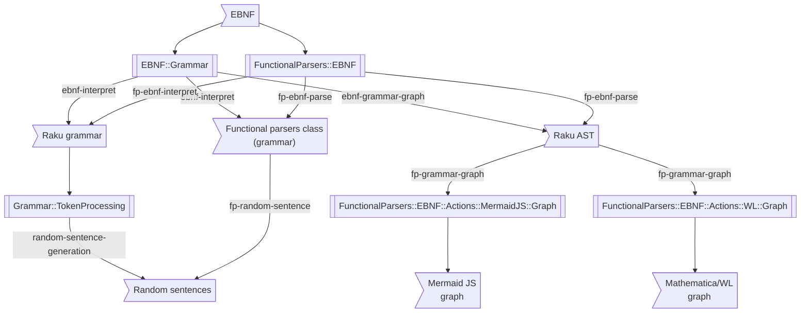

# EBNF::Grammar Raku package

## Introduction

Raku package for Extended Backus-Naur Form (EBNF) parsing and interpretation.

The grammar follows the description of the Wikipedia entry 
["Extended Backus–Naur form"](https://en.wikipedia.org/wiki/Extended_Backus–Naur_form), [Wk1],
which refers to the *proposed* ISO/IEC 14977 standard, by R. S. Scowen, page 7, table 1. [RS1, ISO1].

### Motivation

The main motivation for this package is to have:
1. Multiple EBNF styles parsed (quickly)
2. Grammar generation for multiple languages

The motivation comes from the the "need" to parse (and interpret) EBNF grammars
generated with Large Language Models (LLMs), like ChatGPT and PaLM. For more details see
["Incremental grammar enhancement"](https://github.com/antononcube/Raku-EBNF-Grammar/blob/main/doc/Incremental-grammar-enhancement.md).

I considered extending ["Grammar::BNF"](https://raku.land/github:tadzik/Grammar::BNF),
but ultimately decided that "Grammar::BNF" needs too much refactoring for my purposes,
and, well, it is for BNF not EBNF.

------

## Installation

From [Zef ecosystem](https://raku.land):

```
zef install EBNF::Grammar;
```

From GitHub:

```
zef install https://github.com/antononcube/Raku-EBNF-Grammar.git
```

------

## Usage examples

Here is an EBNF grammar for integers and its interpretation into a Raku grammar:

```perl6
use EBNF::Grammar;

my $ebnf = q:to/END/;
<digit> = '0' | '1' | '2' | '3' | '4' | '5' | '6' | '7' | '8' | '9' ;
<integer> = <digit> , { <digit> } ;
<TOP> = <integer> ;
END

ebnf-interpret($ebnf);
```

Here the obtained Raku grammar is evaluated and used to do a few parsings:  

```perl6
my $gr = ebnf-interpret($ebnf):eval;

.say for <212 89 9090>.map({ $gr.parse($_) });
```

------

### Random sentence generation

Random sentences of grammars given in EBNF can be generated with additional help of the package 
["Grammar::TokenProcessing"](https://github.com/antononcube/Raku-Grammar-TokenProcessing), [AAp2].

Here is an EBNF grammar:

```perl6
my $ebnfCode = q:to/END/;
<statement> = <who> , <verb> , <lang> ;
<who> = 'I' | 'We' ;
<verb> = [ 'really' ] , ( 'love' | 'hate' | { '♥️' } | '🤮' );
<lang> = 'Julia' | 'Perl' | 'Python' | 'R' | 'WL' ; 
END
```

Here is the corresponding Raku grammar:

```perl6, result=asis, output-prompt=NONE, output-lang=perl6
ebnf-interpret($ebnfCode, name=>'LoveHateProgLang');
```

Here we generate random sentences:

```perl6
use Grammar::TokenProcessing;

my $gr = ebnf-interpret($ebnfCode, name=>'LoveHateProgLang'):eval;

.say for random-sentence-generation($gr, '<statement>') xx 12;
```

------

## CLI

The package provides a Command Line Interface (CLI) script for parsing EBNF. Here is its usage message:

```shell
ebnf-parse --help
```

------

## Implementation notes

1. The first version of "EBNF::Grammar::Standardish" was *generated* with "FunctionalParsers", [AAp1], using the EBNF grammar (given in EBNF) in [Wk1].
2. Refactored `<term>` (originally `<pTERM>`) into separate parenthesized, optional, and repeated specs.
   - This corresponds to the design in "FunctionalParsers". 
3. Tokens and regexes were renamed. (More concise, easier to read names.)
4. Implemented the "relaxed" version of the standard EBNF.

------

## Comparison with other packages

The following table overviews the similarities and differences of this package
with the packages "FunctionalParsers" and "Grammar::TokenProcessing":

| Feature                          | FunctionalParsers | EBNF::Grammar | Grammar::TokenProcessing | 
|:---------------------------------|:-----------------:|:-------------:|:------------------------:|
| **Parsing EBNF:**                |                   |               |            ✔             |           
| Standard                         |         ✔         |       ✔       |                          |           
| Modified versions                |         ✔         |       ✔       |                          |           
| Whatever                         |         ✔         |               |                          |           
| Automatic top rule determination |         ✔         |               |                          |           
| **Parsing Raku grammar:**        |                   |               |            ✔             |           
| Pick left and pick right         |         ✔         |               |                          |           
| Skip element                     |                   |               |            ✔             |           
| Automatic top rule determination |         ✔         |               |            ✔             |           
| Comprehensive quantifiers        |                   |               |            ✔             |           
| **Interpretation:**              |         ✔         |       ✔       |                          |           
| Raku grammar                     |         ✔         |       ✔       |                          |           
| EBNF grammar (standard)          |         ✔         |               |            ✔             |           
| WL grammar                       |         ✔         |               |                          |           
| Java functional parsers          |         ✔         |               |                          |           
| Raku functional parsers          |         ✔         |               |                          |           
| Scala functional parsers         |         ✔         |               |                          |           
| WL functional parsers            |         ✔         |       ✔       |                          |           
| **Random sentence generation**   |         ✔         |               |            ✔             |           
| **CLI**                          |         ✔         |       ✔       |            ✔             |           

Here are some additional- and clarification points:

- Since one of the motivations for "FunctionalParsers" and "EBNF::Grammar" is parsing and interpretation of EBNF
grammars derived with Large Language Models (LLMs) multiple EBNF variants have to be parsed.
  - And a `Whatever` parsing method would be of great convenience.

- It is envisioned that "EBNF::Grammar" is completed with functionalities from "Grammar::TokenProcessing". 
  - (Like random sentence generation.)  

- Both "FunctionalParsers" and "EBNF::Grammar" generate Functional Parsers (FPs) for other programming languages
because many languages have packages implementing FPs.

- The interpretations to FPs of other programming languages (Java, Swift) with "EBNF::Grammar" will be also implemented.

- In many cases the parsing with "EBNF::Grammar" is much faster than "FunctionalParsers".
  - The conjecture that that would be case was one of the motivations for implementing of "EBNF::Grammar".

- Cross-interfacing:
  - The package "Grammar::TokenProcessing" can translate Raku grammars into EBNFs.
  - Both "FunctionalParsers" and "EBNF::Grammar" can translate EBNFs into Raku grammars.
  - "EBNF::Grammar" can generate parser classes with utilizing the FPs of "FunctionalParsers". 
  
The following diagram summarizes relationships (and implied workflows) in the comparison table
and clarification points above:



------

## TODO

- [ ] TODO Parsing of EBNF
    - [X] DONE Parse apply function, `<@` 
    - [ ] TODO Sequence-pick-left, `<&`
    - [ ] TODO Sequence-pick-right, `&>`
    - [ ] TODO "Named" tokens
        - [ ] `'_?StringQ'` or `'_String'`
        - [ ] `'_WordString'`, `'_LetterString'`, and `'_IdentifierString'`
        - [ ] `'_?NumberQ'` and `'_?NumericQ'`
        - [ ] `'_Integer'`
        - [ ] `'Range[*from*, *to*]'`
- [ ] TODO Interpreters of EBNF
    - [ ] TODO Java
        - [ ] TODO ["funcj.parser"](https://github.com/typemeta/funcj/tree/master/parser)
    - [ ] TODO Mermaid JS
      - [X] DONE Simple
      - [ ] TODO Proper
        - Most likely, via "FunctionalParsers"
    - [ ] TODO Scala
        - [ ] TODO built-in
        - [ ] TODO [parsley](https://github.com/j-mie6/parsley)
    - [ ] MAYBE Python
    - [ ] TODO Raku
        - [X] DONE Grammar
        - [X] DONE FunctionalParsers
        - [ ] TODO MermaidJS
        - [ ] Other EBNF styles
    - [ ] TODO WL
        - [X] DONE FunctionalParsers, [AAp1, AAp2]
        - [ ] TODO GrammarRules
- [X] DONE Implement grammar-graph translator
  - Introduced dependency on ["FunctionalParsers"](https://github.com/antononcube/Raku-FunctionalParsers) 
- [X] DONE CLI

------

## References

### Articles

[Wk1] Wikipedia entry, ["Extended Backus–Naur form"](https://en.wikipedia.org/wiki/Extended_Backus–Naur_form).

[RS1] Roger S. Scowen: Extended BNF — A generic base standard. Software Engineering Standards Symposium 1993.

[ISO1] [ISO/IEC 14977:1996](https://www.iso.org/standard/26153.html).

### Packages, repositories

[AAp1] Anton Antonov,
[FunctionParsers Raku package](https://github.com/antononcube/Raku-FunctionalParsers),
(2023),
[GitHub/antononcube](https://github.com/antononcube).

[AAp2] Anton Antonov,
[Grammar::TokenProcessing Raku package](https://github.com/antononcube/Raku-Grammar-TokenProcessing),
(2022-2023),
[GitHub/antononcube](https://github.com/antononcube).
