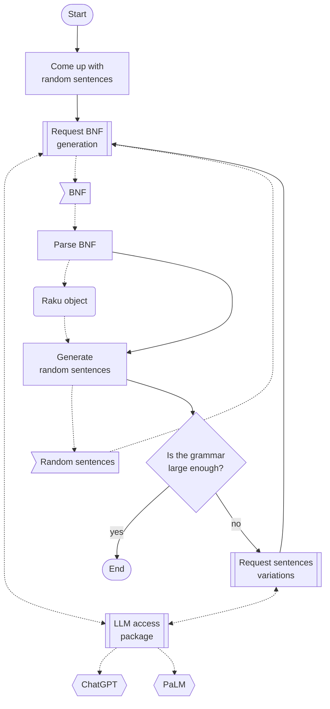

# Incremental grammar enhancement

## Introduction


-------

## Procedure outline



1. Come up with sentences from a certain Domain Specific Language (DSL).
2. Request a certain Large Language Model (LLM) -- for example, ChatGPT or PaLM -- to generate a corresponding grammar in Backus-Naur Form (BNF).
3. Using the obtained BNF string create a corresponding Raku object that can be used generate new random sentences. One of:
   - Raku class for "FunctionalParsers"
   - Raku grammar
4. With Raku object generate a set of random sentences.
5. Request LLM to come up with, say, 5-10 variations of each sentence.
6. Request BNF for the new, enhanced set of sentences.
7. Is the obtained grammar large or comprehensive enough?
   - If not then go to step 2.
   - If yes finish.

-------

## Setup

Here are the packages we are going to use:

```perl6
use Grammar::TokenProcessing;
use EBNF::Grammar;
use FunctionalParsers;
use WWW::OpenAI;
use WWW::PaLM;
```

-------

## Several iterations

```perl6
my @startSentences = [
  'I hate R', 'I love WL', 'We hate WL', 'I love R', 
  'I love Julia', 'I hate R', 'We hate R', 'I hate WL' 
];
```

```perl6
my $request1 = "Generate BNF grammar for the sentences: {@startSentences.join(', ')}";
my $variations1 = palm-generate-text($request1, format=>'values', temperature => 0.85, max-output-tokens => 600);
$variations1
```

```perl6
my $variations2 = $variations1.lines.grep({ EBNF::Grammar::Relaxed.parse($_, rule => 'rule') }).join("\n");
```

```perl6
my $grCode = ebnf-interpret($variations2, style => 'relaxed', name => 'First');
say $grCode;
```

```perl6
my $gr = ebnf-interpret($variations2, name=>'First'):eval;

my @genSentences = random-sentence-generation($gr, '<S>') xx 12;

.say for @genSentences;
```

-------

## References

### Articles

### Packages, repositories